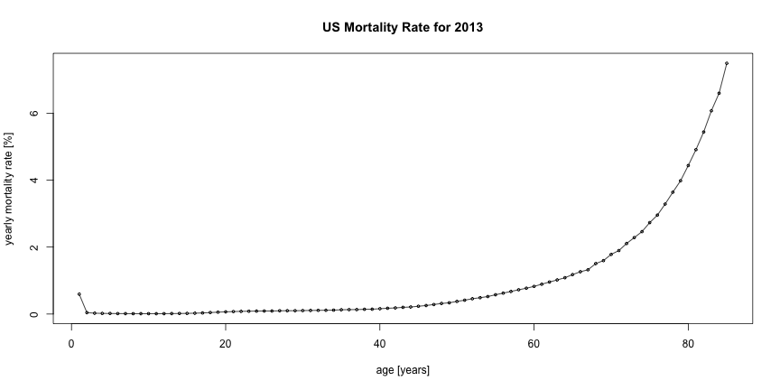

## Mortality Rate Predictor

* What is it?
* Why would anybody want it?

--- 

## Underlying Mortality Rate Data

Mortality rates are based on data from the
[CDC WONDER Online Database](http://wonder.cdc.gov/wonder/help/ucd.html).

The graph below shows the overall yearly mortality rate by age across all population groups.

---

## Prediction Algorithm

From the yearly mortality rate data we predict the mortality rate over the precition time range with the following formula:

$$overall\_mortality\_rate = 1 - \displaystyle\prod_{age=start}^{end} (1 - morality\_rate_{age})$$

---

## Go try it out for yourself

It's easy.
* Select your demographic and prediction time range.
* Get a result instantly.
* Enyoj still being alive.

[Try it out now](https://ibinado.shinyapps.io/mortality)
